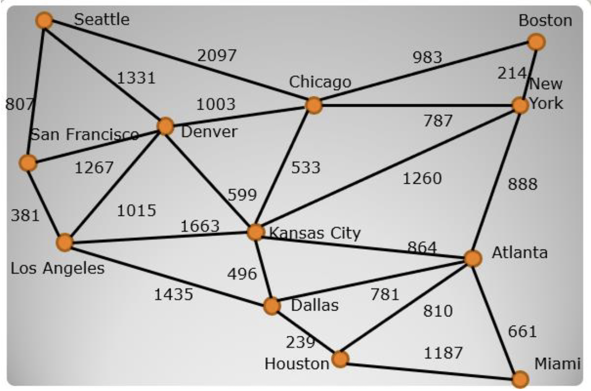

# Assignment 12

## __Part A__
Develop software to perform a DFS starting at Dallas (always 
choose the edge with the smallest mileage).   Identify the 
discovery edges and the back edges within your code.  When 
identifying edges output the origin vertex and destination vertex 
(not the actual distance). There should only be one output per 
edge with the corresponding type. What is the total distance 
travelled on the discovery edges? Use an Adjacency List 
structure. 

## __Part B__
Develop software to perform a BFS starting at Dallas (always 
choose the edge with the smallest mileage).  Identify the 
discovery edges and the cross edges within your code. When 
identifying edges output the origin vertex and destination vertex 
(not the actual distance). There should only be one output per 
edge with the corresponding type.  What is the total distance 
travelled on the discovery edges? Use an Adjacency Matrix 
structure. 
 
*For the levels after level 1, use the first vertex chosen in the 
previous level to determine the order to choose the vertices.*

##Outputs

### Part A (Djikstra's Algorithm)
     ============================
     PART A: Djikstra's Algorithm
     ============================
     
     Dallas to Seattle: 2426 mi
     path from Dallas to Seattle: Dallas->Kansas City->Denver->Seattle
     
     Dallas to San Francisco: 1816 mi
     path from Dallas to San Francisco: Dallas->Los Angeles->San Francisco
     
     Dallas to Denver: 1095 mi
     path from Dallas to Denver: Dallas->Kansas City->Denver
     
     Dallas to Chicago: 1029 mi
     path from Dallas to Chicago: Dallas->Kansas City->Chicago
     
     Dallas to Boston: 1883 mi
     path from Dallas to Boston: Dallas->Atlanta->New York->Boston
     
     Dallas to New York: 1669 mi
     path from Dallas to New York: Dallas->Atlanta->New York
     
     Dallas to Los Angeles: 1435 mi
     path from Dallas to Los Angeles: Dallas->Los Angeles
     
     Dallas to Kansas City: 496 mi
     path from Dallas to Kansas City: Dallas->Kansas City
     
     Dallas to Atlanta: 781 mi
     path from Dallas to Atlanta: Dallas->Atlanta
     
     Dallas to Dallas: 0 mi
     path from Dallas to Dallas: Dallas
     
     Dallas to Houston: 239 mi
     path from Dallas to Houston: Dallas->Houston
     
     Dallas to Miami: 1426 mi
     path from Dallas to Miami: Dallas->Houston->Miami
    
### Part B (MST)
    
